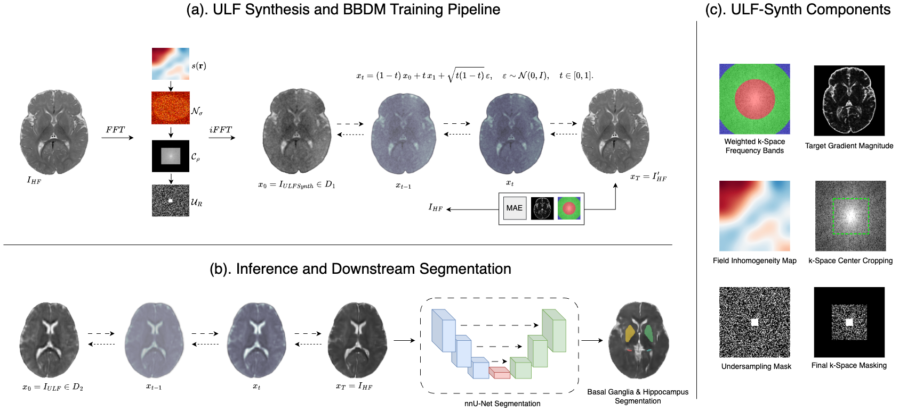

<p align="center">
  
</p>

<h1 align="center">ULF-Synth: Physics-Guided Ultra-Low-Field MRI Enhancement for Pediatric Neuroimaging</h1>

<p align="center">
  <a href="https://arxiv.org/abs/2605.24625v1"></a>
  <a href="https://opensource.org/licenses/MIT"></a>
  <a href="https://www.python.org/"></a>
</p>

<p align="center">
  <b>Synthesize realistic ultra-low-field (ULF) MRI from high-field (HF) scans using physics-guided degradation modeling.</b>
</p>

<hr>

## Overview

**ULF-Synth** is a Python pipeline that converts high-field (HF, 1.5T/3T) structural MRI into synthetic ultra-low-field (ULF, 64 mT) images for pediatric neuroimaging research. It simulates the key physical effects that degrade image quality at low field strengths, enabling training and evaluation of ULF-enhancement methods without requiring a physical ULF scanner.

The synthesis pipeline models the following physical phenomena:

| Effect | Implementation |
|---|---|
| **Signal scaling** | $(B_{ULF} / B_{HF})^2$ polarization ratio |
| **T2\* decay & B0 inhomogeneity** | Spatially-varying exponential decay from random B0 field maps |
| **Thermal noise** | Gaussian noise scaled to realistic SNR (15–50) |
| **k-space cropping** | Reduced resolution 45–55% of original |
| **k-space undersampling** | Accelerated acquisition (2×–3×) with center-out sampling |
| **B0 off-resonance distortion** | Phase distortion from random B0 field maps |

<p align="center">
  
</p>

## Installation

```bash
git clone https://github.com/toufiqmusah/ULF-Synth.git
cd ULF-Synth
pip install -r requirements.txt
```

**Dependencies:** `numpy`, `nibabel`, `scipy`

## Usage

Synthesize a single ULF volume:

```bash
python synthesize-ulf.py input.nii.gz output.nii.gz
```

Process an entire folder of NIfTI files:

```bash
python synthesize-ulf.py /path/to/hf/scans/ /path/to/ulf/scans/
```

With a fixed random seed for reproducibility:

```bash
python synthesize-ulf.py input.nii.gz output.nii.gz --seed 42
```

The output is a NIfTI file containing the synthetic ULF image (preserving the input's affine and header metadata).

## Roadmap

- [x] Physics-guided ULF synthesis pipeline
- [ ] **Pre-trained weights** — enhancement models for ULF→HF mapping
- [ ] **Python package** — `pip install ulf-synth`
- [ ] **Docker image** — zero-config containerized pipeline

## Citation

If you use ULF-Synth in your research, please cite:

```bibtex
@misc{musah2026ulfsynth,
  title        = {ULF-Synth: Physics-Guided Ultra-Low-Field MRI Enhancement for Pediatric Neuroimaging},
  author       = {Toufiq Musah and Salvatore Calcagno and Federica Proietto Salanitri and Xiaomeng Li and Maruf Adewole and Marawan Elbatel},
  year         = {2026},
  eprint       = {2605.24625},
  archivePrefix= {arXiv},
  url          = {https://arxiv.org/abs/2605.24625}
}
```

## License

This project is licensed under the MIT License — see the [LICENSE](LICENSE) file for details.
